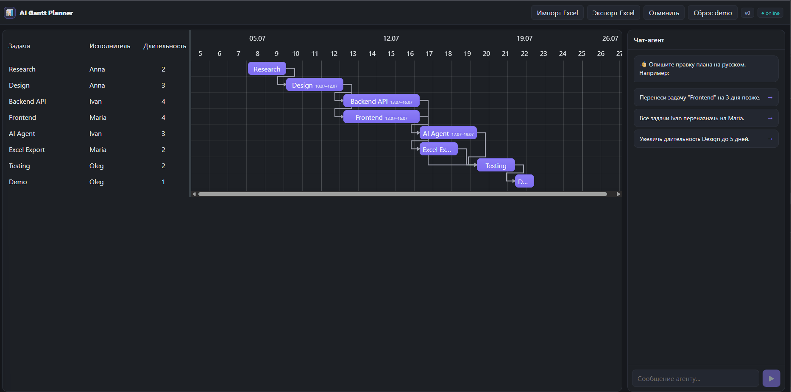

# AI Gantt Planner

[](https://github.com/doooksa/ai-gantt-planner/actions/workflows/ci.yml)

Интерактивная диаграмма Гантта + LLM-чат-агент, который редактирует план проекта
на естественном языке. Импорт/экспорт Excel. Агент **никогда не пишет в базу
напрямую** — он лишь переводит естественный язык в структурированные операции
через **MCP-инструменты**; бэкенд валидирует каждую операцию, применяет её
атомарно и **детерминированно пересчитывает расписание**. Даты задач всегда
*вычисляются*, никогда не хранятся.

**Живое демо:** [фронтенд (Vercel)](https://ai-gantt-planner-three.vercel.app) ·
[бэкенд (Render)](https://ai-gantt-api.onrender.com/api/health) ·
[интерактивная API-документация (Swagger)](https://ai-gantt-api.onrender.com/docs)

> Бэкенд на бесплатном тарифе Render засыпает при простое — первая загрузка может
> ~30 с показывать лоадер «Сервер просыпается…». Чату нужен оплаченный LLM-ключ,
> заданный на бэкенде; диаграмма, импорт/экспорт Excel, модалка задачи и undo
> работают независимо от него.

> Статус: **готов к сдаче.** Фазы 1–3 завершены и прошли гейты; приложение
> задеплоено на Vercel (фронт) + Render (бэк), живой прогон 10 эталонных команд
> против прода — **10/10**. Полный демо-сценарий (правка через чат → блок
> Applied changes → live-обновление диаграммы по WebSocket → undo, плюс Excel и
> модалка задачи) работает end-to-end. См. [§6](#6-деплой).



_Демо: правка плана на естественном языке через чат-агента — применённые изменения, live-пересчёт диаграммы и откат (undo)._

---

## 1. Архитектура

```
                    ┌─────────────────────────────────────────────────────┐
  Браузер           │  FastAPI-процесс (один)                             │
 ┌────────┐  REST   │   ┌───────────────┐        ┌──────────────────────┐ │
 │ React  │◄──────► │   │  REST-роуты   │        │  MCP-сервер (/mcp,    │ │
 │  +SVAR │  SSE    │   │  /api/*       │        │  streamable HTTP)     │ │
 │  Gantt │◄──────► │   │  /api/chat    │        │  get_plan             │ │
 │  +chat │   WS    │   └──────┬────────┘        │  validate_patch       │ │
 └────────┘◄──────► │          │                 │  apply_patch          │ │
             /ws    │   ┌──────▼────────┐  MCP    │  undo_last            │ │
                    │   │ агентский цикл│◄───────►│  (клиент по HTTP)     │ │
                    │   │  (llm/agent)  │  tools  └──────────┬───────────┘ │
                    │   └──────┬────────┘                    │             │
                    │          │ OpenRouter             ┌────▼──────────┐  │
                    │          ▼ (openai SDK)           │  services.py  │  │
                    │      ☁ LLM                        │ (единый путь) │  │
                    │                                   └────┬──────────┘  │
                    │                     ┌──────────────────▼───────────┐ │
                    │                     │ domain: scheduler/validators │ │
                    │                     │ patches · storage (SQLite)   │ │
                    │                     └──────────────────────────────┘ │
                    └─────────────────────────────────────────────────────┘
```

И REST-роуты, и MCP-инструменты идут через **единый слой `services.py`**, поэтому
правка агентом и правка руками пользователя ведут себя одинаково и обе
бродкастят `{version, diff}` по WebSocket.

## 2. Как используется MCP

LLM **не является источником истины** и **не имеет прямого доступа к данным**.
Она может вызвать только четыре MCP-инструмента:

| Инструмент | Назначение |
|---|---|
| `get_plan()` | текущий план с вычисленными датами |
| `validate_patch(patch)` | сухой прогон: diff + ошибки, **без применения** |
| `apply_patch(patch)` | атомарно применить, пересчитать, бродкастнуть, вернуть diff |
| `undo_last()` | откат к предыдущему снапшоту |

Почему слой инструментов, а не прямая запись LLM в БД: каждая мутация
**валидируется** (существование, циклы, длительности), **атомарна** (одна плохая
операция откатывает весь патч), а расписание **детерминированно пересчитывается
кодом**, а не моделью. Задача модели — только NL → структурированный `Patch`; за
корректность отвечает бэкенд. Именно это делает систему устойчивой к выбору
модели (см. [Выбор модели](#8-выбор-модели)).

## 3. Как работает агент

Цикл (`apps/backend/app/llm/agent.py`, максимум 10 итераций):

1. `list_tools()` у MCP-сервера → конвертация схем в формат OpenAI tools
   (`mcp_openai_bridge.py`).
2. сообщение пользователя → `chat.completions` с tools → `tool_calls`
   → `session.call_tool()` → результаты обратно → до финального текстового ответа.
3. Указания в системном промпте: сначала прочитать план (`get_plan`), проверить
   через `validate_patch`, затем `apply_patch`; массовые правки — **одним** патчем
   с селектором (например, `by_assignee`), а не N вызовами.

Агент транспортонезависим: принимает готовую MCP-`ClientSession` и
OpenAI-совместимый клиент, поэтому весь цикл покрыт оффлайн-тестами с фейковым
LLM, а живой гейт из 10 команд гоняется против реальной модели.

## 4. Формат Excel

Колонки импорта (регистронезависимо, с нормализацией пробелов), только первый
лист, `read_only=True`:

```
задача, описание, исполнитель, длительность, предшественники
```

- **предшественники** — *имена* задач через запятую, резолвятся в id;
  несуществующее имя → понятная ошибка пользователю.
- **длительность** — целое ≥ 1; невалидное значение → ошибка с **номером строки**.
- **Экспорт** добавляет вычисленные `дата начала`, `дата конца`.

См. `examples/sample_plan.xlsx` (тот же план, что и demo-seed).

## 5. Локальный запуск

### Бэкенд (работает сразу)

```bash
cd apps/backend
python -m venv .venv
.venv/Scripts/activate            # Windows;  source .venv/bin/activate на *nix
pip install -r requirements.txt
cp ../../.env.example .env         # затем впишите OPENROUTER_API_KEY в .env
uvicorn app.main:app --reload --port 8000
```

- Оффлайн-тесты: `pytest -m "not live"` (63 passed).
- Живой гейт агента (нужен `OPENROUTER_API_KEY`): `pytest tests/test_agent_scenarios.py`.

### Фронтенд (Фаза 3) — **нужен Node.js 20+**

```bash
cd apps/frontend
npm install
npm run dev            # http://localhost:5173, проксирует API на :8000
```

### docker-compose

```bash
cp .env.example apps/backend/.env      # затем задайте OPENROUTER_API_KEY
docker compose up --build              # бэкенд + фронтенд (nginx)
# откройте http://localhost:5173
```

Контейнер фронтенда (nginx) отдаёт собранный SPA и реверс-проксирует `/api` и
`/ws` на контейнер бэкенда, поэтому браузер общается **same-origin** — максимально
близко к топологии Vercel+Render в пределах одного хоста.

> ⚠️ **Локально `docker compose up` не прогонялся.** В среде разработки, где
> писались эти файлы, демон Docker был недоступен, поэтому end-to-end `up` **не
> выполнялся здесь.** Compose проходит `docker compose config` (синтаксис и
> интерполяция валидны), Dockerfile'ы следуют стандартным паттернам
> Python-slim / node-build→nginx, но первый реальный запуск на машине с рабочим
> демоном может потребовать доработки. Не-Docker локальный запуск выше
> **проверен** (63 теста зелёные, фронт собирается, демо-сценарий проходит).

## 6. Деплой

Фронтенд → **Vercel**, бэкенд → **Render**. Манифесты закоммичены:

| Файл | Роль |
|---|---|
| `render.yaml` | Render Blueprint — бэкенд как Docker web service, `healthCheckPath: /api/health` |
| `apps/backend/Dockerfile` | образ бэкенда (биндится на `$PORT` от Render) |
| `apps/frontend/vercel.json` | сборка Vercel + SPA-rewrites |
| `apps/frontend/Dockerfile` + `nginx.conf` | только для docker-compose, не для Vercel |

**Переменные окружения**

*Бэкенд (Render):*

| Переменная | Пример | Примечание |
|---|---|---|
| `OPENROUTER_API_KEY` | `sk-or-…` | секрет; задаётся в дашборде |
| `LLM_MODEL` | `anthropic/claude-haiku-4.5` | по умолчанию |
| `FRONTEND_ORIGIN` | `https://ai-gantt-planner-three.vercel.app` | allowlist CORS; допустим **список через запятую** для preview-URL Vercel |
| `DATABASE_URL` | `sqlite:///./gantt.db` | эфемерна на free-тарифе (см. roadmap) |

*Фронтенд (Vercel):*

| Переменная | Пример | Примечание |
|---|---|---|
| `VITE_API_BASE` | `https://ai-gantt-api.onrender.com` | origin бэкенда; `VITE_API_URL` — алиас. WS сам выводит `wss://` из `https`-базы |

**Холодный старт.** Free-тариф Render засыпает после ~15 мин простоя, первый
запрос тогда занимает ~30 с. Фронт это обрабатывает: начальная загрузка повторяет
запрос с backoff за лоадером **«Сервер просыпается…»**, а WebSocket
переподключается с нарастающей паузой — так спящий бэкенд деградирует до короткого
ожидания, а не до ошибки.

**Пошаговый клик-через** (сначала Render, потом Vercel) — в
[docs/DEPLOY.md](docs/DEPLOY.md).

## 7. Справочник API и Excel

```
GET  /api/plan                GET  /api/health
POST /api/upload-excel        POST /api/undo
GET  /api/export-excel        POST /api/reset-demo
POST /api/chat  (SSE)         WS   /ws   → {version, diff}
```

Origin для CORS берётся из `FRONTEND_ORIGIN`. FastAPI также отдаёт интерактивную
документацию на **`/docs`** (Swagger UI), `/redoc` (ReDoc) и схему на
`/openapi.json`.

## 8. Выбор модели

LLM-провайдер полностью конфигурируем — бэкенд управляет любым OpenAI-совместимым
эндпоинтом через три env-переменные (без правок кода):

| Переменная | По умолчанию | Назначение |
|---|---|---|
| `LLM_BASE_URL` | `https://openrouter.ai/api/v1` | базовый URL API |
| `LLM_API_KEY_ENV` | `OPENROUTER_API_KEY` | имя env-переменной с ключом |
| `LLM_MODEL` | `anthropic/claude-haiku-4.5` | id модели |

**По умолчанию: OpenRouter + Haiku 4.5.** Замерено на гейте Фазы 2 (10 эталонных
команд в `apps/backend/tests/test_agent_scenarios.py`):

| Модель | Провайдер | Корректность | Стабильность | Время / команду |
|---|---|---|---|---|
| **`anthropic/claude-haiku-4.5`** (дефолт) | OpenRouter | **10 / 10** | **5 / 5 прогонов** | ~8 с |
| `anthropic/claude-sonnet-4.5` | OpenRouter | **10 / 10** | 1 прогон (контроль) | ~14 с |
| `gemini-2.5-flash` | Google AI Studio | корректно и быстро, но **гейт не прогоняется на free-тарифе** | — | ~2–8 с |

**Вывод:** корректность обеспечивает слой инструментов/валидации/планировщика, а
не модель — поэтому архитектура **устойчива к выбору модели**. Смена провайдера —
правка только env.

**Про бесплатные тарифы (оценены, не приняты).** Тестировались и free-модели
OpenRouter, и free-тариф Google; ни один не тянет агентскую нагрузку:

- `gemini-2.5-flash` быстр (~2–8 с/команду) и корректно зовёт инструменты, но
  free-тариф ограничен **~5 запросов/минуту И ~20 запросов/сутки** на модель. Одна
  команда агента делает несколько запросов, поэтому дневная квота даёт лишь
  *несколько правок в сутки* — гейт 5×10 (~200 запросов) не проходит, а реальный
  пользователь упрётся в лимит почти сразу.
- Free-модели OpenRouter упираются в rate-лимиты аккаунта и апстрим-провайдера
  (429).

Поэтому по умолчанию — **платная** модель (Haiku 4.5, она копеечная). Чтобы
использовать Google в проде, направьте профиль на **платный** тариф Google —
переключение тем же env. Готовый Google-профиль — в `.env.example`.

## 9. Использование AI-ассистентов

Проект построен с Claude Code (Opus 4.8), фиксировано по фазам в
[docs/AI_USAGE.md](docs/AI_USAGE.md): что делегировано, что модель предложила
неверно и как исправлено, что проверено руками. Ключевое:

- Домен, планировщик, валидаторы, патчи, Excel I/O, storage и весь бэкенд MCP +
  агента сгенерированы с Claude Code, затем закрыты тестами.
- Фронтенд (диаграмма, чат-панель, модалка задачи, тулбар) и весь слой деплоя
  (Dockerfile'ы, nginx, compose, `render.yaml`, `vercel.json`, обработка
  холодного старта) сгенерированы с Claude Code.
- Заметные правки в диалоге: `offset_days` — чтобы даты оставались вычисляемыми,
  но поддерживался сдвиг; отказ сдвигать раньше самой ранней даты; каталог
  payload-операций в описаниях инструментов (починил флак агента промптом);
  форматтеры шкалы на date-fns (строковые токены SVAR — не date-fns); размер
  диаграммы по высоте контента + выравнивание сетки/недель.
- Честность про проверку: `docker compose up` **нельзя** было запустить в среде
  (нет демона Docker), поэтому он помечен как *локально не проверен*, а не выдан
  за протестированное — см. [docs/AI_USAGE.md](docs/AI_USAGE.md) и
  [docs/STATUS.md](docs/STATUS.md).

## 10. Известные ограничения

- **Календарные дни**, не рабочие (рабочие дни — в roadmap).
- Excel round-trip не сохраняет ручной сдвиг (`offset_days`) — в 5-колоночном
  формате для него нет места; структура сохраняется (задокументировано + тест).
- Один проект, без авторизации, без drag-and-drop-редактирования полей (вне
  скоупа ТЗ).
- Агентский SSE стримит события (`tool`/`applied`/`message`/`done`), а не
  по-токенно.
- **Бесплатные LLM-тарифы непригодны** для этого агентского приложения (каждая
  правка = несколько запросов к LLM): free-тариф Google — ~5 req/min + ~20
  req/day на модель, free-модели OpenRouter лимитируются под нагрузкой. Нужен
  платный доступ — см. [Выбор модели](#8-выбор-модели). Гейт можно замедлить под
  минутную квоту через `GATE_PAUSE_SECONDS`, но дневной лимит — жёсткая стена.

## 11. Roadmap

См. [docs/ROADMAP_TO_PRODUCTION.md](docs/ROADMAP_TO_PRODUCTION.md).
